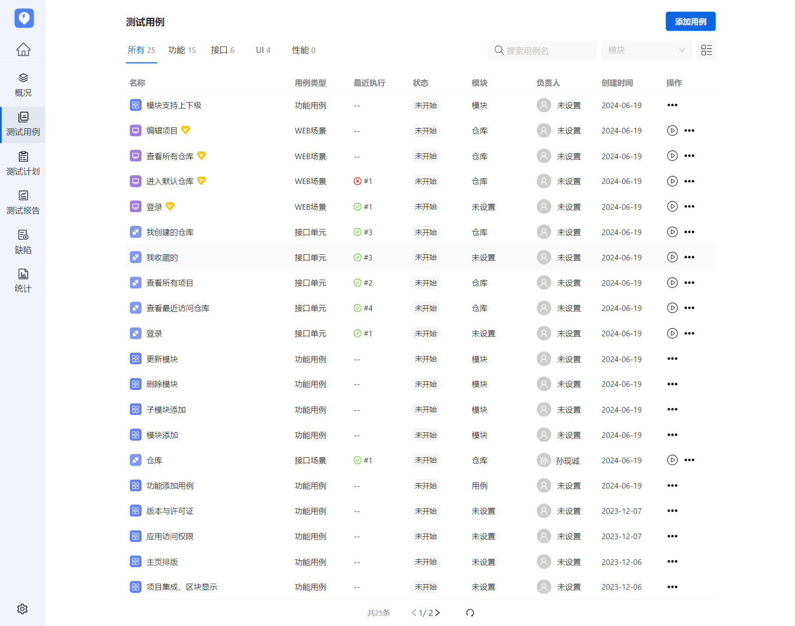
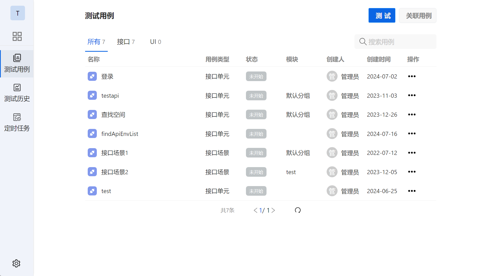
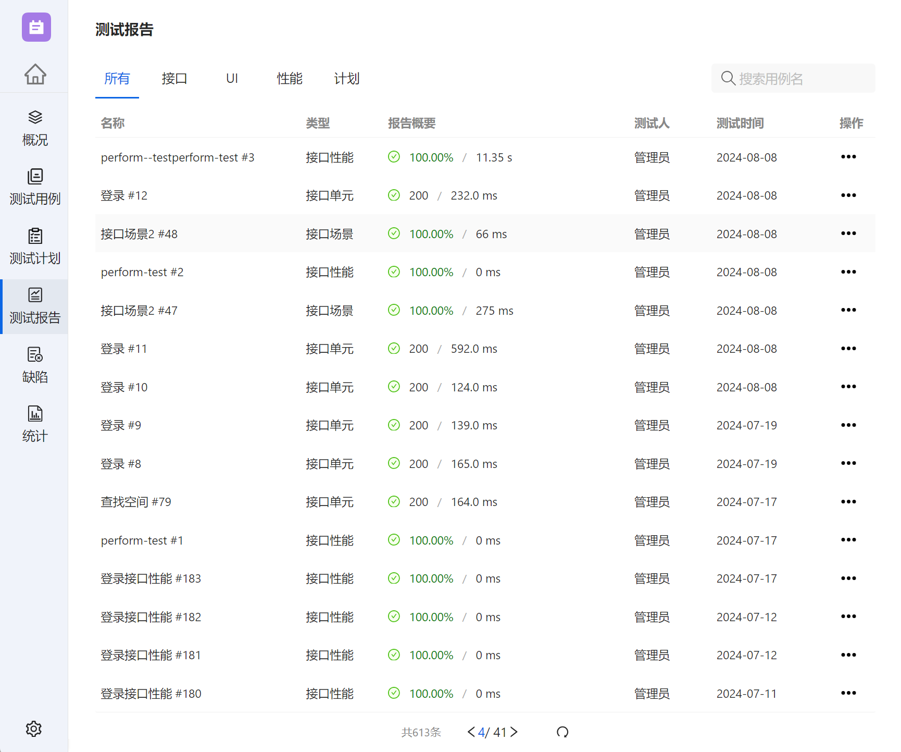

# TestHubo - 开源免费的全栈测试平台

<p >
  <a href="https://github.com/tiklab/postin"></a>
  <a href="https://github.com/tiklab/postin/releases"></a>
  <a href="https://github.com/tiklab/postin/releases"></a>
</p>


TestHubo 是一款全面的开源全栈测试平台，旨在满足现代开发团队的多样化测试需求。与 Selenium 和 JMeter 等传统工具相比，TestHubo 支持功能测试、接口测试、性能测试，以及 Web 和移动应用测试，帮助团队提升软件质量和交付效率。

## 主要功能
### 1. 测试用例
- **功能测试**：验证软件功能是否按预期运行，确保用户需求满足。
- **接口测试**：检查接口间的数据交互，确保传输准确，降低系统集成风险。
- **接口场景测试**：模拟真实用户场景，评估接口在不同条件下的表现。
- **性能测试**：测试系统在高负载下的响应和稳定性，识别性能瓶颈。
- **Web测试**：全面测试网页应用的功能、兼容性和用户体验，确保跨设备一致性。
- **App测试**：专为移动应用设计的测试功能，确保应用在各种移动设备上的流畅运行。

  
### 2. 测试计划
- **测试用例管理**：按项目需求关联测试用例，覆盖功能、接口、场景等测试类型。
- **测试历史**：每次执行后自动生成测试报告，包含测试结果、成功率、失败率等。
- **定时任务**：支持自动化测试的定时执行，确保定期质量检查。

  
### 3. 测试报告
- **自动生成报告**：每次测试后自动生成详细报告，包含测试结果、成功率、失败率等信息。
- **可视化分析**：通过图表展示测试结果，帮助团队清晰了解测试进展、性能和缺陷分布。


### 4. 缺陷管理
- TestHubo 与 KANASS 集成，帮助团队在测试中更好地关联和管理缺陷。

### 5. 测试统计
- **新增用例统计**：展示不同时间段内新增的测试用例数量，反映测试覆盖范围的扩展。
- **用例测试统计**：统计已执行、未执行和失败用例的数量，帮助团队实时了解测试进展。

## TestHubo 的优势
- **简洁易用**：界面直观，操作简单，开发者可以快速上手，无需复杂配置。
- **开源免费**：TestHubo 是完全免费的开源工具，用户可以自由获取和使用。
- **多终端支持**：兼容不同操作系统和设备，灵活部署，满足团队需求。
- **多版本支持**：支持公有云和私有部署，灵活适应不同企业和项目的需求。

## 下载与演示
了解更多关于 TestHubo 的信息和功能，请访问以下链接：
- [产品首页](https://testhubo.tiklab.net)
- [产品演示](https://testhubo.tiklab.net/demo)
- [产品下载](https://testhubo.tiklab.net/download)

## 运行 TestHubo
请确保你已经部署好所需的开发环境

**安装依赖**
```
npm install
```

**运行**
```
npm run start
```

